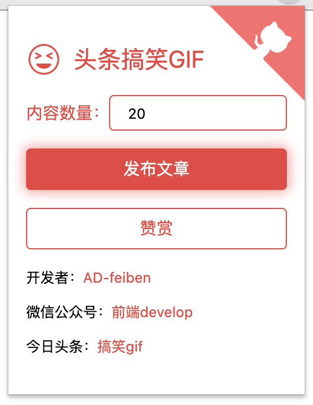

## plugin-toutiao

  

这是一款 Chrome 的插件，主要是优化 [toutiao](https://github.com/AD-feiben/toutiao) (Python 版本)。

- [x] 相比于 Python 版本免去了重复打开新浏览器设置 cookies 等流程，从而提升发布文章的速度。

- [x] 无需安装开发环境，降低用户使用门槛，达到一键获取数据发布文章的效果。

## 运行效果

  

## 使用

1、下载该项目；

2、在 Chrome 浏览器输入 `chrome://extensions/` 打开扩展程序页面、打开开发者模式；

3、点击加载已解压的扩展程序，选择该项目；

4、登录头条；

5、点击插件，开始发布文章。

## 注意事项

1. 每日只能发布 4 篇文章左右，请勿做太多尝试

2. 该项目仅作为学习使用，请勿用于商业用途

## 交流&赞赏

|公众号|赞赏|
|:-:|:-:|
|||

## License

